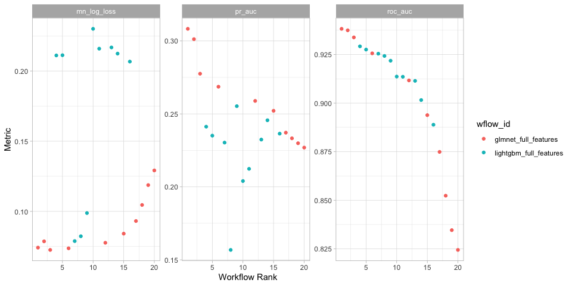
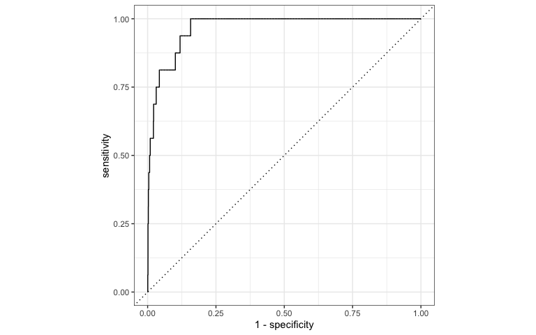
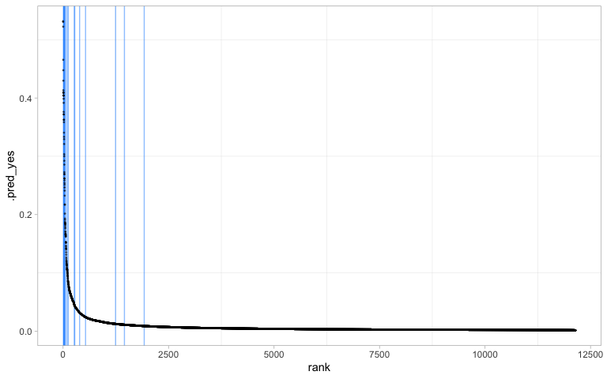

# Model Card

2024-08-14

``` r
library(dplyr)
library(ggplot2)
library(vetiver)
library(pins)
library(yardstick)

# targets
targets::tar_source("src")
targets::tar_load(model_meta)
targets::tar_load(test_data)
targets::tar_load(my_metrics)
targets::tar_load(valid_metrics)
targets::tar_load(wflows_plot)

# load in model
v <- vetiver_pin_read(board = model_board(),
                      name = model_meta$name,
                      version = model_meta$version)

# get metadata
v_meta <- pin_meta(board = model_board(),
                   name = model_meta$name)

# set ggplot theme
theme_set(theme_light())

# create gt table with formatting
gt_tbl = function(data) {
    
    data |>
        gt::gt() |>
        gt::as_raw_html()
}
```

A [model card](https://doi.org/10.1145/3287560.3287596) provides brief,
transparent, responsible reporting for a trained machine learning model.

## Model details

- A glmnet classification modeling workflow using 15 features
- Version 20240814T203541Z-60514 of this model was published at
  2024-08-14 15:35:41

## Model candidates

- Workflows trained and evaluated on the validation set

``` r
wflows_plot
```



``` r
valid_metrics |>
    arrange(.metric) |>
    mutate_if(is.numeric, round, 3) |>
    gt_tbl()
```

<div>

<div id="hhsujfouku" style="padding-left:0px;padding-right:0px;padding-top:10px;padding-bottom:10px;overflow-x:auto;overflow-y:auto;width:auto;height:auto;">
  &#10;  

| wflow_id               | .config               | .metric     |  mean | std_err |   n | preprocessor | model        | rank |
|:-----------------------|:----------------------|:------------|------:|--------:|----:|:-------------|:-------------|-----:|
| glmnet_full_features   | Preprocessor1_Model08 | mn_log_loss | 0.073 |      NA |   1 | recipe       | logistic_reg |    1 |
| glmnet_pca             | Preprocessor1_Model05 | mn_log_loss | 0.076 |      NA |   1 | recipe       | logistic_reg |    2 |
| lightgbm_full_features | Preprocessor1_Model04 | mn_log_loss | 0.079 |      NA |   1 | recipe       | boost_tree   |    3 |
| glmnet_full_features   | Preprocessor1_Model08 | pr_auc      | 0.278 |      NA |   1 | recipe       | logistic_reg |    1 |
| glmnet_pca             | Preprocessor1_Model05 | pr_auc      | 0.261 |      NA |   1 | recipe       | logistic_reg |    2 |
| lightgbm_full_features | Preprocessor1_Model04 | pr_auc      | 0.230 |      NA |   1 | recipe       | boost_tree   |    3 |
| glmnet_full_features   | Preprocessor1_Model08 | roc_auc     | 0.934 |      NA |   1 | recipe       | logistic_reg |    1 |
| glmnet_pca             | Preprocessor1_Model05 | roc_auc     | 0.901 |      NA |   1 | recipe       | logistic_reg |    2 |
| lightgbm_full_features | Preprocessor1_Model04 | roc_auc     | 0.925 |      NA |   1 | recipe       | boost_tree   |    3 |

</div>

</div>

## Training data & evaluation data

- The training dataset for this model has the “prototype” or signature:

``` r
glimpse(v$prototype)
```

    Rows: 0
    Columns: 15
    $ minplayers  <int> 
    $ maxplayers  <int> 
    $ playingtime <int> 
    $ minplaytime <int> 
    $ maxplaytime <int> 
    $ minage      <int> 
    $ categories  <chr> 
    $ mechanics   <chr> 
    $ publishers  <chr> 
    $ designers   <chr> 
    $ artists     <chr> 
    $ families    <chr> 
    $ mechanisms  <chr> 
    $ components  <chr> 
    $ themes      <chr> 

- The model was trained on
  `v$metadata$user$split$data |> bind_cols() |> nrow()` games published
  through `r`v$metadata$user\$end_train_year\`

- The evaluation dataset used in this model card is `test_data`, which
  contains games from the following years:

``` r
test_data |>
    group_by(yearpublished) |>
    count() |>
    gt_tbl()
```

<div>

<div id="vddafzknpp" style="padding-left:0px;padding-right:0px;padding-top:10px;padding-bottom:10px;overflow-x:auto;overflow-y:auto;width:auto;height:auto;">
  &#10;  

| n    |
|:-----|
| 2022 |
| 4861 |
| 2023 |
| 4870 |
| 2024 |
| 2227 |
| 2025 |
| 180  |
| 2026 |
| 8    |

</div>

</div>

## Quantitative analyses

``` r
# predict new data (test data)
preds <- augment(v, test_data)
```

### Overall model performance

``` r
preds |>
    my_metrics(own, 
               .pred_yes,
               event_level = 'second') |>
    mutate_if(is.numeric, round, 3) |>
    gt_tbl()
```

<div>

<div id="vyyzcnceoa" style="padding-left:0px;padding-right:0px;padding-top:10px;padding-bottom:10px;overflow-x:auto;overflow-y:auto;width:auto;height:auto;">
  &#10;  

| .metric     | .estimator | .estimate |
|:------------|:-----------|----------:|
| roc_auc     | binary     |     0.967 |
| pr_auc      | binary     |     0.072 |
| mn_log_loss | binary     |     0.011 |

</div>

</div>

### Visualize model performance

``` r
preds |>
    yardstick::roc_curve(
        truth = own,
        .pred_yes,
        event_level = 'second'
    ) |>
    autoplot()
```



### Separation

``` r
preds |>
    plot_separation()
```



## Predictions

Top predictions from the model

``` r
preds |>
    slice_max(.pred_yes, n = 50) |>
    arrange(desc(.pred_yes)) |>
    mutate_if(is.numeric, round, 3) |>
    select(game_id, name, yearpublished, .pred_yes, own) |>
    gt_tbl()
```

<div>

<div id="ftcyqttkbf" style="padding-left:0px;padding-right:0px;padding-top:10px;padding-bottom:10px;overflow-x:auto;overflow-y:auto;width:auto;height:auto;">
  &#10;  

| game_id | name                                                                | yearpublished | .pred_yes | own |
|--------:|:--------------------------------------------------------------------|--------------:|----------:|:---:|
|  390478 | Gloomhaven: Second Edition                                          |          2024 |     0.532 | no  |
|  416510 | Akhedena                                                            |          2024 |     0.531 | no  |
|  382518 | Sankoré: The Pride of Mansa Musa                                    |          2024 |     0.522 | no  |
|  258779 | Planet Unknown                                                      |          2022 |     0.466 | no  |
|  354051 | SPYBAM                                                              |          2022 |     0.448 | no  |
|  331106 | The Witcher: Old World                                              |          2023 |     0.430 | no  |
|  366495 | Undaunted: Battle of Britain                                        |          2023 |     0.413 | yes |
|  326936 | Unmatched: Teen Spirit                                              |          2023 |     0.410 | no  |
|  326937 | Unmatched: For King and Country                                     |          2023 |     0.410 | no  |
|  305096 | Endless Winter: Paleoamericans                                      |          2022 |     0.409 | no  |
|  326933 | Unmatched: Redemption Row                                           |          2022 |     0.404 | no  |
|  326934 | Unmatched: Hell's Kitchen                                           |          2022 |     0.404 | no  |
|  310873 | Carnegie                                                            |          2022 |     0.404 | no  |
|  346151 | Elric: Rise of the Young Kingdoms                                   |          2023 |     0.399 | no  |
|  376095 | Emperor of the Gaels                                                |          2024 |     0.392 | no  |
|  381711 | Pizzachef                                                           |          2023 |     0.376 | no  |
|  349067 | The Lord of the Rings: The Card Game – Revised Core Set             |          2022 |     0.372 | yes |
|  414283 | Arkendom Conquista Starter Set                                      |          2023 |     0.372 | no  |
|  295770 | Frosthaven                                                          |          2022 |     0.363 | yes |
|  354570 | Undaunted: Stalingrad                                               |          2022 |     0.362 | yes |
|  405775 | Dogville                                                            |          2024 |     0.359 | no  |
|  401978 | Undaunted 2200: Callisto                                            |          2024 |     0.341 | no  |
|  402276 | Avalon: The Riven Veil                                              |          2025 |     0.333 | no  |
|  368320 | アンドーンテッド：ノルマンディー・プラス (Undaunted: Normandy Plus) |          2022 |     0.329 | no  |
|  365430 | Warhammer: The Horus Heresy – Age of Darkness                       |          2022 |     0.321 | no  |
|  391137 | Galactic Cruise                                                     |          2024 |     0.304 | no  |
|  310100 | Nemesis: Lockdown                                                   |          2022 |     0.300 | no  |
|  380508 | Rough Draft                                                         |          2023 |     0.292 | no  |
|  341945 | La Granja: Deluxe Master Set                                        |          2023 |     0.286 | no  |
|  313104 | Antematter                                                          |          2022 |     0.273 | no  |
|  412762 | Widgets n' Digit\$                                                  |          2024 |     0.270 | no  |
|  411861 | Unmatched: Realms Fall                                              |          2024 |     0.269 | no  |
|  359394 | My Island                                                           |          2023 |     0.262 | no  |
|  413663 | Pizzaiolo                                                           |          2024 |     0.262 | no  |
|  411860 | Unmatched: Steel and Silver                                         |          2024 |     0.259 | no  |
|  256680 | Return to Dark Tower                                                |          2022 |     0.254 | yes |
|  397598 | Dune: Imperium – Uprising                                           |          2023 |     0.251 | no  |
|  322524 | Bardsung                                                            |          2022 |     0.246 | no  |
|  356238 | Terra Mystica: Big Box                                              |          2022 |     0.241 | no  |
|  354544 | Unmatched: Houdini vs. The Genie                                    |          2022 |     0.232 | yes |
|  395375 | Art Society                                                         |          2023 |     0.217 | no  |
|  352574 | Fit to Print                                                        |          2023 |     0.217 | no  |
|  410704 | Planet Zad                                                          |          2024 |     0.202 | no  |
|  359237 | Pirate Tales                                                        |          2023 |     0.193 | no  |
|  393165 | Inferno                                                             |          2024 |     0.191 | no  |
|  352899 | Mythika: The Olympians                                              |          2023 |     0.187 | no  |
|  401636 | Tacta                                                               |          2023 |     0.186 | no  |
|  275284 | Arkeis                                                              |          2023 |     0.185 | no  |
|  395405 | Reign of Hades                                                      |          2025 |     0.184 | no  |
|  415945 | Unmatched: Slings & Arrows                                          |          2024 |     0.184 | no  |

</div>

</div>
