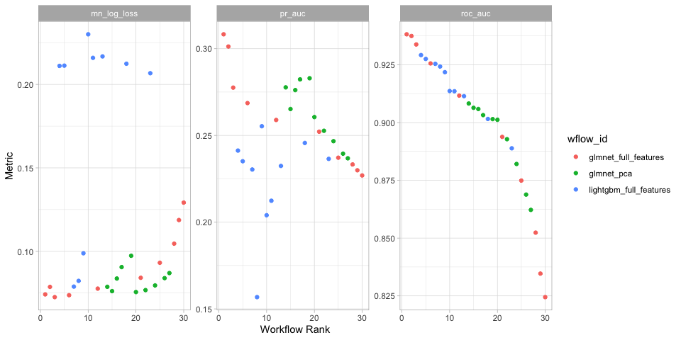

# Model Card

2024-08-14

``` r
library(dplyr)
library(ggplot2)
library(vetiver)
library(pins)
library(yardstick)

# targets
targets::tar_source("src")
targets::tar_load(model_meta)
targets::tar_load(test_data)
targets::tar_load(my_metrics)
targets::tar_load(valid_metrics)
targets::tar_load(wflows_plot)

# load in model
v <- vetiver_pin_read(board = model_board(),
                      name = model_meta$name,
                      version = model_meta$version)

# get metadata
v_meta <- pin_meta(board = model_board(),
                   name = model_meta$name)

# set ggplot theme
theme_set(theme_light())

# create gt table with formatting
gt_tbl = function(data) {
    
    gt::tbl() |>
        gt::as_raw_html()
}
```

A [model card](https://doi.org/10.1145/3287560.3287596) provides brief,
transparent, responsible reporting for a trained machine learning model.

## Model details

- A glmnet classification modeling workflow using 15 features
- Version 20240814T151510Z-6e357 of this model was published at
  2024-08-14 10:15:10

## Model candidates

- Workflows trained and evaluated on the validation set

``` r
wflows_plot
```



``` r
valid_metrics |>
    arrange(.metric) |>
    mutate_if(is.numeric, round, 3) |>
    as.data.frame()
```

                     wflow_id               .config     .metric  mean std_err n
    1    glmnet_full_features Preprocessor1_Model08 mn_log_loss 0.073      NA 1
    2    glmnet_full_features Preprocessor1_Model07 mn_log_loss 0.074      NA 1
    3    glmnet_full_features Preprocessor1_Model09 mn_log_loss 0.074      NA 1
    4    glmnet_full_features Preprocessor1_Model06 mn_log_loss 0.078      NA 1
    5    glmnet_full_features Preprocessor1_Model10 mn_log_loss 0.079      NA 1
    6  lightgbm_full_features Preprocessor1_Model04 mn_log_loss 0.079      NA 1
    7  lightgbm_full_features Preprocessor1_Model06 mn_log_loss 0.082      NA 1
    8    glmnet_full_features Preprocessor1_Model05 mn_log_loss 0.084      NA 1
    9    glmnet_full_features Preprocessor1_Model04 mn_log_loss 0.093      NA 1
    10 lightgbm_full_features Preprocessor1_Model09 mn_log_loss 0.099      NA 1
    11   glmnet_full_features Preprocessor1_Model03 mn_log_loss 0.105      NA 1
    12   glmnet_full_features Preprocessor1_Model02 mn_log_loss 0.119      NA 1
    13   glmnet_full_features Preprocessor1_Model01 mn_log_loss 0.129      NA 1
    14 lightgbm_full_features Preprocessor1_Model07 mn_log_loss 0.207      NA 1
    15 lightgbm_full_features Preprocessor1_Model01 mn_log_loss 0.211      NA 1
    16 lightgbm_full_features Preprocessor1_Model02 mn_log_loss 0.211      NA 1
    17 lightgbm_full_features Preprocessor1_Model10 mn_log_loss 0.212      NA 1
    18 lightgbm_full_features Preprocessor1_Model08 mn_log_loss 0.216      NA 1
    19 lightgbm_full_features Preprocessor1_Model05 mn_log_loss 0.217      NA 1
    20 lightgbm_full_features Preprocessor1_Model03 mn_log_loss 0.230      NA 1
    21   glmnet_full_features Preprocessor1_Model08      pr_auc 0.278      NA 1
    22   glmnet_full_features Preprocessor1_Model07      pr_auc 0.269      NA 1
    23   glmnet_full_features Preprocessor1_Model09      pr_auc 0.308      NA 1
    24   glmnet_full_features Preprocessor1_Model06      pr_auc 0.259      NA 1
    25   glmnet_full_features Preprocessor1_Model10      pr_auc 0.301      NA 1
    26 lightgbm_full_features Preprocessor1_Model04      pr_auc 0.230      NA 1
    27 lightgbm_full_features Preprocessor1_Model06      pr_auc 0.157      NA 1
    28   glmnet_full_features Preprocessor1_Model05      pr_auc 0.252      NA 1
    29   glmnet_full_features Preprocessor1_Model04      pr_auc 0.237      NA 1
    30 lightgbm_full_features Preprocessor1_Model09      pr_auc 0.255      NA 1
    31   glmnet_full_features Preprocessor1_Model03      pr_auc 0.233      NA 1
    32   glmnet_full_features Preprocessor1_Model02      pr_auc 0.230      NA 1
    33   glmnet_full_features Preprocessor1_Model01      pr_auc 0.227      NA 1
    34 lightgbm_full_features Preprocessor1_Model07      pr_auc 0.236      NA 1
    35 lightgbm_full_features Preprocessor1_Model01      pr_auc 0.241      NA 1
    36 lightgbm_full_features Preprocessor1_Model02      pr_auc 0.235      NA 1
    37 lightgbm_full_features Preprocessor1_Model10      pr_auc 0.246      NA 1
    38 lightgbm_full_features Preprocessor1_Model08      pr_auc 0.212      NA 1
    39 lightgbm_full_features Preprocessor1_Model05      pr_auc 0.232      NA 1
    40 lightgbm_full_features Preprocessor1_Model03      pr_auc 0.204      NA 1
    41   glmnet_full_features Preprocessor1_Model08     roc_auc 0.934      NA 1
    42   glmnet_full_features Preprocessor1_Model07     roc_auc 0.926      NA 1
    43   glmnet_full_features Preprocessor1_Model09     roc_auc 0.938      NA 1
    44   glmnet_full_features Preprocessor1_Model06     roc_auc 0.912      NA 1
    45   glmnet_full_features Preprocessor1_Model10     roc_auc 0.937      NA 1
    46 lightgbm_full_features Preprocessor1_Model04     roc_auc 0.925      NA 1
    47 lightgbm_full_features Preprocessor1_Model06     roc_auc 0.924      NA 1
    48   glmnet_full_features Preprocessor1_Model05     roc_auc 0.894      NA 1
    49   glmnet_full_features Preprocessor1_Model04     roc_auc 0.875      NA 1
    50 lightgbm_full_features Preprocessor1_Model09     roc_auc 0.922      NA 1
    51   glmnet_full_features Preprocessor1_Model03     roc_auc 0.852      NA 1
    52   glmnet_full_features Preprocessor1_Model02     roc_auc 0.835      NA 1
    53   glmnet_full_features Preprocessor1_Model01     roc_auc 0.824      NA 1
    54 lightgbm_full_features Preprocessor1_Model07     roc_auc 0.889      NA 1
    55 lightgbm_full_features Preprocessor1_Model01     roc_auc 0.929      NA 1
    56 lightgbm_full_features Preprocessor1_Model02     roc_auc 0.928      NA 1
    57 lightgbm_full_features Preprocessor1_Model10     roc_auc 0.902      NA 1
    58 lightgbm_full_features Preprocessor1_Model08     roc_auc 0.914      NA 1
    59 lightgbm_full_features Preprocessor1_Model05     roc_auc 0.911      NA 1
    60 lightgbm_full_features Preprocessor1_Model03     roc_auc 0.914      NA 1
       preprocessor        model rank
    1        recipe logistic_reg    1
    2        recipe logistic_reg    2
    3        recipe logistic_reg    3
    4        recipe logistic_reg    4
    5        recipe logistic_reg    5
    6        recipe   boost_tree    6
    7        recipe   boost_tree    7
    8        recipe logistic_reg    8
    9        recipe logistic_reg    9
    10       recipe   boost_tree   10
    11       recipe logistic_reg   11
    12       recipe logistic_reg   12
    13       recipe logistic_reg   13
    14       recipe   boost_tree   14
    15       recipe   boost_tree   15
    16       recipe   boost_tree   16
    17       recipe   boost_tree   17
    18       recipe   boost_tree   18
    19       recipe   boost_tree   19
    20       recipe   boost_tree   20
    21       recipe logistic_reg    1
    22       recipe logistic_reg    2
    23       recipe logistic_reg    3
    24       recipe logistic_reg    4
    25       recipe logistic_reg    5
    26       recipe   boost_tree    6
    27       recipe   boost_tree    7
    28       recipe logistic_reg    8
    29       recipe logistic_reg    9
    30       recipe   boost_tree   10
    31       recipe logistic_reg   11
    32       recipe logistic_reg   12
    33       recipe logistic_reg   13
    34       recipe   boost_tree   14
    35       recipe   boost_tree   15
    36       recipe   boost_tree   16
    37       recipe   boost_tree   17
    38       recipe   boost_tree   18
    39       recipe   boost_tree   19
    40       recipe   boost_tree   20
    41       recipe logistic_reg    1
    42       recipe logistic_reg    2
    43       recipe logistic_reg    3
    44       recipe logistic_reg    4
    45       recipe logistic_reg    5
    46       recipe   boost_tree    6
    47       recipe   boost_tree    7
    48       recipe logistic_reg    8
    49       recipe logistic_reg    9
    50       recipe   boost_tree   10
    51       recipe logistic_reg   11
    52       recipe logistic_reg   12
    53       recipe logistic_reg   13
    54       recipe   boost_tree   14
    55       recipe   boost_tree   15
    56       recipe   boost_tree   16
    57       recipe   boost_tree   17
    58       recipe   boost_tree   18
    59       recipe   boost_tree   19
    60       recipe   boost_tree   20

## Training data & evaluation data

- The training dataset for this model was …
- The training dataset for this model has the “prototype” or signature:

``` r
glimpse(v$prototype)
```

    Rows: 0
    Columns: 15
    $ minplayers  <int> 
    $ maxplayers  <int> 
    $ playingtime <int> 
    $ minplaytime <int> 
    $ maxplaytime <int> 
    $ minage      <int> 
    $ categories  <chr> 
    $ mechanics   <chr> 
    $ publishers  <chr> 
    $ designers   <chr> 
    $ artists     <chr> 
    $ families    <chr> 
    $ mechanisms  <chr> 
    $ components  <chr> 
    $ themes      <chr> 

- The evaluation dataset used in this model card is …
- We chose this evaluation data because …

``` r
test_data |>
    skimr::skim()
```

|                                                  |           |
|:-------------------------------------------------|:----------|
| Name                                             | test_data |
| Number of rows                                   | 12146     |
| Number of columns                                | 44        |
| \_\_\_\_\_\_\_\_\_\_\_\_\_\_\_\_\_\_\_\_\_\_\_   |           |
| Column type frequency:                           |           |
| character                                        | 17        |
| factor                                           | 3         |
| logical                                          | 1         |
| numeric                                          | 21        |
| POSIXct                                          | 2         |
| \_\_\_\_\_\_\_\_\_\_\_\_\_\_\_\_\_\_\_\_\_\_\_\_ |           |
| Group variables                                  | None      |

Data summary

**Variable type: character**

| skim_variable | n_missing | complete_rate | min |  max | empty | n_unique | whitespace |
|:--------------|----------:|--------------:|----:|-----:|------:|---------:|-----------:|
| name          |         0 |          1.00 |   2 |  227 |     0 |    12112 |          0 |
| description   |         0 |          1.00 |   2 | 8757 |     0 |    12135 |          0 |
| thumbnail     |      1439 |          0.88 | 140 |  141 |     0 |    10698 |          0 |
| image         |      1439 |          0.88 | 133 |  134 |     0 |    10698 |          0 |
| categories    |       380 |          0.97 |   4 |  193 |     0 |     4521 |          0 |
| mechanics     |       944 |          0.92 |   4 |  533 |     0 |     7126 |          0 |
| publishers    |      8820 |          0.27 |   4 |   51 |     0 |       91 |          0 |
| designers     |      2274 |          0.81 |   2 |  196 |     0 |     6223 |          0 |
| artists       |      5370 |          0.56 |   2 | 1185 |     0 |     4369 |          0 |
| families      |      5249 |          0.57 |  10 |  669 |     0 |     2330 |          0 |
| mechanisms    |     11307 |          0.07 |   2 |   60 |     0 |       49 |          0 |
| components    |     10898 |          0.10 |   4 |  110 |     0 |      238 |          0 |
| themes        |     10162 |          0.16 |   9 |  146 |     0 |      401 |          0 |
| username      |         0 |          1.00 |  11 |   11 |     0 |        1 |          0 |
| url           |     12130 |          0.00 |  95 |   95 |     0 |        1 |          0 |
| type          |     12130 |          0.00 |   9 |    9 |     0 |        1 |          0 |
| ever_owned    |         0 |          1.00 |   2 |    3 |     0 |        2 |          0 |

**Variable type: factor**

| skim_variable | n_missing | complete_rate | ordered | n_unique | top_counts         |
|:--------------|----------:|--------------:|:--------|---------:|:-------------------|
| own           |         0 |             1 | FALSE   |        2 | no: 12130, yes: 16 |
| rated         |         0 |             1 | FALSE   |        2 | no: 12140, yes: 6  |
| highly_rated  |         0 |             1 | FALSE   |        1 | yes: 12146, no: 0  |

**Variable type: logical**

| skim_variable    | n_missing | complete_rate | mean | count |
|:-----------------|----------:|--------------:|-----:|:------|
| wishlistpriority |     12146 |             0 |  NaN | :     |

**Variable type: numeric**

| skim_variable | n_missing | complete_rate |      mean |        sd |      p0 |       p25 |       p50 |       p75 |        p100 | hist  |
|:--------------|----------:|--------------:|----------:|----------:|--------:|----------:|----------:|----------:|------------:|:------|
| game_id       |         0 |          1.00 | 375686.72 |  33454.48 | 13651.0 | 362368.25 | 378950.50 | 400619.25 |   417754.00 | ▁▁▁▁▇ |
| yearpublished |         0 |          1.00 |   2022.81 |      0.78 |  2022.0 |   2022.00 |   2023.00 |   2023.00 |     2026.00 | ▇▇▃▁▁ |
| averageweight |      7265 |          0.40 |      2.07 |      0.82 |     1.0 |      1.47 |      2.00 |      2.60 |        5.00 | ▇▇▃▁▁ |
| usersrated    |         0 |          1.00 |     83.58 |    478.02 |     0.0 |      0.00 |      3.00 |     19.00 |    19891.00 | ▇▁▁▁▁ |
| average       |      3154 |          0.74 |      7.40 |      1.39 |     1.0 |      6.66 |      7.39 |      8.20 |       10.00 | ▁▁▂▇▃ |
| bayesaverage  |      9658 |          0.20 |      5.70 |      0.33 |     5.1 |      5.53 |      5.57 |      5.69 |        8.11 | ▇▂▁▁▁ |
| numweights    |         0 |          1.00 |      3.68 |     20.25 |     0.0 |      0.00 |      0.00 |      2.00 |      587.00 | ▇▁▁▁▁ |
| minplayers    |        91 |          0.99 |      1.82 |      0.77 |     1.0 |      1.00 |      2.00 |      2.00 |       10.00 | ▇▁▁▁▁ |
| maxplayers    |       105 |          0.99 |      7.73 |     19.04 |     1.0 |      4.00 |      4.00 |      6.00 |     1000.00 | ▇▁▁▁▁ |
| playingtime   |       839 |          0.93 |   1478.91 | 148388.57 |     1.0 |     30.00 |     45.00 |     90.00 | 15778800.00 | ▇▁▁▁▁ |
| minplaytime   |       784 |          0.94 |     37.31 |     48.91 |     1.0 |     15.00 |     30.00 |     45.00 |     2400.00 | ▇▁▁▁▁ |
| maxplaytime   |       839 |          0.93 |   1478.91 | 148388.57 |     1.0 |     30.00 |     45.00 |     90.00 | 15778800.00 | ▇▁▁▁▁ |
| minage        |       856 |          0.93 |     10.53 |      3.20 |     1.0 |      8.00 |     10.00 |     13.00 |       60.00 | ▇▃▁▁▁ |
| rating        |     12140 |          0.00 |      8.33 |      0.82 |     7.0 |      8.00 |      8.50 |      9.00 |        9.00 | ▂▁▅▁▇ |
| preordered    |     12130 |          0.00 |      0.00 |      0.00 |     0.0 |      0.00 |      0.00 |      0.00 |        0.00 | ▁▁▇▁▁ |
| prevowned     |     12130 |          0.00 |      0.00 |      0.00 |     0.0 |      0.00 |      0.00 |      0.00 |        0.00 | ▁▁▇▁▁ |
| fortrade      |     12130 |          0.00 |      0.00 |      0.00 |     0.0 |      0.00 |      0.00 |      0.00 |        0.00 | ▁▁▇▁▁ |
| want          |     12130 |          0.00 |      0.00 |      0.00 |     0.0 |      0.00 |      0.00 |      0.00 |        0.00 | ▁▁▇▁▁ |
| wanttoplay    |     12130 |          0.00 |      0.00 |      0.00 |     0.0 |      0.00 |      0.00 |      0.00 |        0.00 | ▁▁▇▁▁ |
| wanttobuy     |     12130 |          0.00 |      0.00 |      0.00 |     0.0 |      0.00 |      0.00 |      0.00 |        0.00 | ▁▁▇▁▁ |
| wishlist      |     12130 |          0.00 |      0.00 |      0.00 |     0.0 |      0.00 |      0.00 |      0.00 |        0.00 | ▁▁▇▁▁ |

**Variable type: POSIXct**

| skim_variable | n_missing | complete_rate | min                 | max                 | median              | n_unique |
|:--------------|----------:|--------------:|:--------------------|:--------------------|:--------------------|---------:|
| load_ts       |     12130 |             0 | 2024-04-17 00:52:13 | 2024-04-17 00:52:13 | 2024-04-17 00:52:13 |        1 |
| lastmodified  |     12130 |             0 | 2024-03-26 12:06:26 | 2024-03-28 13:01:59 | 2024-03-26 12:22:48 |       16 |

## Quantitative analyses

``` r
# predict new data (test data)
preds <- augment(v, test_data)
```

### Overall model performance

``` r
preds |>
    my_metrics(own, 
               .pred_yes,
               event_level = 'second') |>
    mutate_if(is.numeric, round, 3)
```

    # A tibble: 3 × 3
      .metric     .estimator .estimate
      <chr>       <chr>          <dbl>
    1 roc_auc     binary         0.967
    2 pr_auc      binary         0.072
    3 mn_log_loss binary         0.011

### Visualize model performance

``` r
preds |>
    yardstick::roc_curve(
        truth = own,
        .pred_yes,
        event_level = 'second'
    ) |>
    autoplot()
```


### Separation

``` r
preds |>
    plot_separation()
```


## Predictions

Top predictions from the model

``` r
preds |>
    slice_max(.pred_yes, n = 50) |>
    arrange(desc(.pred_yes)) |>
    mutate_if(is.numeric, round, 3) |>
    select(game_id, name, yearpublished, .pred_yes, own)
```

    # A tibble: 50 × 5
       game_id name                             yearpublished .pred_yes own  
         <dbl> <chr>                                    <dbl>     <dbl> <fct>
     1  390478 Gloomhaven: Second Edition                2024     0.532 no   
     2  416510 Akhedena                                  2024     0.531 no   
     3  382518 Sankoré: The Pride of Mansa Musa          2024     0.522 no   
     4  258779 Planet Unknown                            2022     0.466 no   
     5  354051 SPYBAM                                    2022     0.448 no   
     6  331106 The Witcher: Old World                    2023     0.43  no   
     7  366495 Undaunted: Battle of Britain              2023     0.413 yes  
     8  326936 Unmatched: Teen Spirit                    2023     0.41  no   
     9  326937 Unmatched: For King and Country           2023     0.41  no   
    10  305096 Endless Winter: Paleoamericans            2022     0.409 no   
    # ℹ 40 more rows
